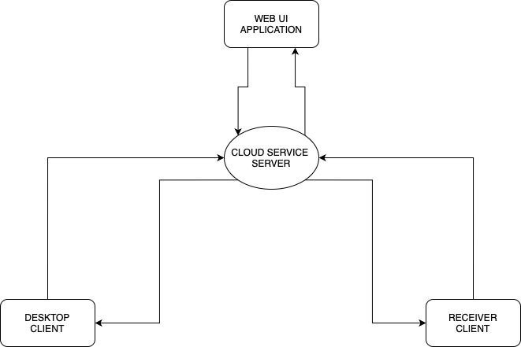
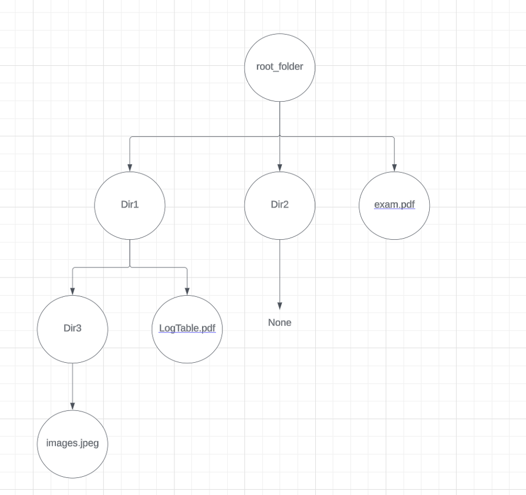
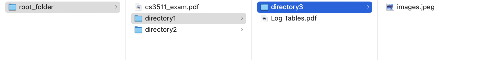

  
# CS3305 Group 11 - Project Report

## K.L.A.A.S - Knowledge Lookup and Archive Access Service

## Introduction

Our application, a File Explorer, Organiser and Sharing system (Project Name - K.L.A.A.S), is designed to streamline the user's interaction with their local filesystem and enhance file management, sharing, and optimisation. It allows users to not only manage their files locally but also to share them via a built-in web server powered by Flask, a lightweight WSGI web application framework.

Our system offers a practical solution for automating and regulating the way in which files systems are organised. It aligns with real-world scenarios where digital workflows ma have become cluttered there is a growing necessity for personal storage optimisation and instant file sharing. The primary functionalities of this application including organisation, optimisation, file visualisation and sharing, all work towards this common goal.

## Project Objectives

The objectives of the project are as follows:

1. To develop a unified platform that simplifies file management through automatic sorting, in-depth organisation, and scheduling features.
2. To enable efficient file sharing capabilities through a cloud-based system, allowing users to share files with external parties securely.
3. To implement advanced file optimisation techniques such as compression and deduplication, thereby enhancing storage efficiency and organisation.

## Architecture

The architecture of K.L.A.A.S is modular, consisting of three primary components:
  
1. Desktop Client,
2. Flask Web Server,
3. WebUI client.
  
The modular architecture of K.L.A.A.S not only ensures a separation of concerns for better manageability and scalability but also allows for the continuous development and enhancement of individual components without disrupting the entire system. This structure supports the evolution of K.L.A.A.S, enabling the incorporation of new features and technologies to meet the changing needs of users.

### Project structure:  

## Desktop Client

The Desktop Client serves as the user's primary interface with K.L.A.A.S, designed for direct interaction with the file system on their computer. Built using PyQt5, it ensures a responsive and visually appealing graphical user interface that operates smoothly across different operating systems. This client enables users to perform a myriad of tasks such as searching for files, organising them into folders, optimising storage through compression and deduplication, and preparing files for sharing. This design emphasises ease of use, aiming to make complex file management tasks accessible to users with varying levels of technical proficiency. It is composed of several key elements:

1. **Search Bar:** A dynamic search utility that allows users to quickly locate files within their local environment. It uses a combination of Qt's QLineEdit for input and QListWidget for displaying real-time search results with custom-styled elements. It is implemented using a custom search algorithm that leverages Python's os library to traverse the file system and the bespoke File System Node Model described below.  
  
2. **File Management:** This module leverages the Python `os` and `shutil` libraries to provide file operations like moving, renaming, deleting, and organising files into folders.
  
3. **File Optimisation:** A feature that includes utilities to compress files, remove duplicates, and perform other optimisation tasks to save disk space and enhance organisation.  
  
4. **Share Functionality:** Integrated within the client, this feature prepares files for sharing by interacting with the Flask Web Server. It packages files, creates shareable links, and communicates with the server via RESTful APIs.

### Rationale for Choosing PyQt5 for the Desktop Client

The decision to use PyQt5 as the foundation for the Desktop Client in the K.L.A.A.S project was driven by several key factors:

1. **Cross-platform Compatibility:** PyQt5 provides excellent support for cross-platform development, enabling our application to run seamlessly on Windows, macOS, and Linux. This was crucial for ensuring that K.L.A.A.S could serve a wide user base, regardless of their operating system.

2. **Rich Set of Widgets:** PyQt5 offers a comprehensive collection of pre-built widgets and tools, which significantly accelerated the development process. This allowed us to focus on implementing functionality rather than worrying about the low-level details of UI components.

3. **Strong Documentation and Community Support:** PyQt5 benefits from extensive documentation and a large, active community. This made it easier to troubleshoot issues, learn best practices, and implement complex features correctly and efficiently.

4. **Graphics and Customisation:** PyQt5's advanced graphics capabilities allowed us to create a visually appealing and intuitive user interface. The ability to customise widgets meant we could tailor the application's look and feel to our specific requirements, enhancing the user experience.

5. **Integration with Python:** As the rest of our project heavily relied on Python for back-end functionality, PyQt5's seamless integration with Python ensured that we could easily connect the UI with the underlying logic. This integration facilitated a smooth development workflow and allowed for rapid prototyping and iteration.

## File System Node / Model Structure

  
  
  
### File System Node Structure

The file system node structure consists of two main classes that represent the file system hierarchy:

1. **Directory Node:** Represents a directory in the file system. It contains a set of child nodes, which can be either files or subdirectories. The root node is the top-level directory in the file system. Because of this structure, the head node is used to represent the entirety of the file system hierarchy.
2. **File Node:** Represents a file in the file system. File objects contain useful metadata such as file size, creation date, and file type. It also contains a reference to the parent directory node. The file node is a leaf node in the overall file system node structure.

### File System Cache

The file system cache is the data structure that stores the file system node structure by using the root node. It is used to improve performance by reducing the number of file system accesses and to provide a consistent view of the file system across different parts of the application.
  
The body of the cache is implemented as a dictionary that maps file paths to file system nodes. The cache is updated whenever the file system is modified, ensuring that it remains synchronised with the underlying file system.
  
### Categorisation Component  
  
An example of how different file types can be handled in the categorisation aspect of the application, we can consider the `Music` class as this example.  
  
This class utilises the `EasyID3` module from the mutagen library to extract metadata from audio files. By leveraging `EasyID3`, the `Music` class ensures efficient extraction of essential information such as artist name, album, track name, and year from audio files.  
  
In cases where metadata extraction encounters exceptions or when metadata is not found, the error-handling mechanism handles these scenarios.  
  
One of the primary functionalities of the `Music` class is to categorise music files into directories based on their metadata, particularly the artist. This categorisation process enhances file organisation and facilitates easier navigation and retrieval of music files.  
  
As a child class of `File` within the `FileSystemNodeModel`, the `Music` class integrates into the existing data structure, enabling a cohesive and structured approach to file management. A similar approach was taken to modelling other file types, such as, `Image`, `Document` & `Video`.  
  

  
### Scheduling Component  
  
The `FileSystemNodeModel` contains a file scheduling component which is designed to automate the organisation of specific files on a set scheduled basis, such as weekly. Leveraging the `sched` module in Python, this scheduler facilitates the scheduling of periodic organisation tasks with precision and reliability.  
  
Threading is employed to run the scheduler in the background, ensuring that the scheduling process does not interfere with other system operations. This multithreading capability enhances system responsiveness and efficiency.  
  
To utilise the File Organiser Scheduler, users can instantiate an object and initiate the scheduler by specifying a directory node where files are to be organised. Once started, the scheduler autonomously organises files on a weekly basis, alleviating the need for manual intervention.  

## Data Flow

The architecture ensures smooth communication between the Desktop Client, Flask Web Server, and WebUI Client. The user interacts with the Desktop Client to manage and select files for sharing. Upon initiating a share operation, the file is sent to the Flask Web Server along with metadata, such as the desired expiry time.
  
This is facilitated through RESTful APIs and secure HTTP(s) protocols, which allow for efficient and secure data transfer. The server stores the file and provides a unique URL which the user can share with others.

The WebUI Client interacts with the server to facilitate file downloads by external users. As external users access the link, the server authenticates the request and serves the file if it has not yet expired. Concurrently, the Expiry Service runs in the background, periodically removing files that have outlived their share duration.

## Technical Challenges and Solutions  
  
The project presented several technical challenges, which were addressed through careful design and implementation. The following are some of the challenges and their solutions:

**Challenge 1:** File Synchronization Across Devices.

- Solution:
  - The file system cache was implemented to maintain a consistent view of the file system across different parts of the application. This allowed for improved performance and ensured that the file system state was synchronised across different components.

**Challenge 2:** Slow Search

- Solution:
  - Implemented a keyword cache that is populated when the filesystem is scanned; allowing for constant time keyword searching (feature of underlying hashmap). This was then expanded to enable substring searching by linear searching through the keys of the keyword hashmap.

**Challenge 3:** Slow Filesystem Scanning

- Solution:
  - The initial implementation scanned the filesystem using Python's os.listDir(), while this seemed to be functional it became prohibitively slow on directories larger than couple dozen files.
  - Upon deeper inspection this was due to the amount of I/O operations required to then process the entries in the directory, this was confirmed by inspecting various usage metrics while the scan was executing (using the command-line utilities `htop` and `fs_usage`).
  - We then began to research alternatives to this method and came across `os.scanDir()`; the key difference with `scanDir` is that it returns an iterator containing `DirEntry` objects, which already contained many of the elements we were performing additional I/O operations to get. This speedup has enabled us to work with directories of a scale not previously possible.

**Challenge 4:** Different Filepath Formats

- Solution:
  - To combat the issue of different ways of storing filepaths (e.g. with or without a trailing '/') we utilised Python's `os.path.normPath()` to normalise paths throughout the application, allowing us to use them as unique identifiers for file nodes in various structures.

## Performance Considerations
  
The performance of K.L.A.A.S is a critical consideration, given the potential impact of file system operations and web server interactions on the user experience. The following performance considerations were taken into account during the design and implementation of the system:

### Filesystem Operations

In order to reduce the burden of filesystem operations, we took the following approach:  
  
- **I/O** Reduce system I/O calls during scanning - as outlined above we iterated on the initial design to reduce the number of I/O operations performed during the application cycle.
  
- **CACHE** Utilise cache structures to allow constant time access to the nodes that represent files/directories in our model. This allowed us to effectively scan the directory once at launch, and then query it without further scanning.
  
## Flask Web Server

At the heart of K.L.A.A.S's sharing functionality is the Flask Web Server, which handles the distribution and management of shared files. Flask was chosen for its lightweight nature and adaptability, allowing for the efficient handling of file transfer requests while maintaining a minimal server footprint. The web server facilitates the secure upload and download of files, employing robust authentication and encryption to safeguard data. The Flask Web Server acts as a file hosting platform to facilitate file sharing:

1. **API Endpoints:** The server provides endpoints for uploading and downloading files. It authenticates requests from the Desktop Client and serves files to external users with temporary access.
2. **File Hosting:** Temporarily hosts the files shared by the user. It manages a directory where files are stored until they expire.
3. **Security:** Implements basic security measures to ensure that only authorised users can upload or access files. This may include token-based authentication, HTTPS for secure transmission, and rate-limiting to prevent abuse.

### Expiry Service

An integral part of the web server is the Expiry Service, which automates the lifecycle management of shared files. This service ensures that files are only available for the duration specified by the user at the time of sharing, after which they are automatically deleted to protect privacy and manage server storage space efficiently. The Expiry Service runs periodic checks on the file repository, identifying and removing files that have reached their expiration date.
The following components are responsible for managing the lifecycle of shared files:

1. **Expiry Mechanism**: It regularly checks the timestamps of hosted files and removes them once their sharing period has expired.
2. **Cleanup**: Frees up server space by safely deleting expired files and any associated metadata.

## WebUI Client

The WebUI Client is a simple web interface that allows external users to access shared files. It is implemented using HTML, CSS, and JavaScript and is served by the Flask Web Server. This component allows recipients of shared files to download them through a secure, temporary link. The WebUI includes features such as a countdown timer to indicate the availability period of the shared files and basic instructions for users to follow for downloading files.

This design ensures that external users do not need to install any special software to access files, making K.L.A.A.S a convenient option for both the sender and the recipient of shared files.

### Web Server Interactions
  
To ensure the web server could handle file sharing requests efficiently, we implemented the following strategies:

#### Server Routes - User Routes  

A core aspect of the file sharing system was having a user, which enabled us to have features like a user profile for keeping track of uploads, updating, and even deleting them before expiry. To have the user work effectively, we needed to have secure user authentication. To do this, various steps were taken to ensure standard security protocols.  
  
We only stored hashed passwords in the database. The python library bcrypt provided us with easy functions to hash and verify passwords encrypted with SHA-256
We ensured that Cross-Site Request Forgery (CSRF) attacks were mitigated by generating CSRF Tokens where forms were used. This was streamlined by using Flask’s WTForms `` in every HTML page in which a form was used.
  
Another key aspect was ensuring the particular user routes, such as profile, could only be accessed by a logged-in user. This was made simple by the Flask library Flask-Login, which allowed us to use decorators like `@login-required` before any route to ensure it is accessed by users who are signed in.

#### Server Routes - File Routes

The other core aspect of the file sharing system, alongside the user, was the file routes.
  
This includes routes:
  
- /upload  
- /download  
- /update_upload  
- /delete_upload  
  
These needed to be secure for certain instances such as when dealing with files that are password protected. Equally, we wanted to enforce stuff like logging in for uploading files, which took advantage of the `@login-required` decorator as mentioned in user routes.
  
Also, similarly to user routes, CSRF Tokens were mitigated with ``   One key aspect to the file routes, was having unique ID’s on both the files and uploads. This key aspect was crucial to everywhere from the filepaths of each file on the server, to the serving of the download to the user.

**File Anonymity:** When the files are uploaded (each with their own unique ID assigned),  filepaths are defined by their unique ID’s. This way, no one can actually identify what files are uploaded on the server. The names of the files are then stored in the Files table on the database, which allows us to piece back together the file name on serving, and displaying it to the user.
  
Secure Downloading: Using unique ID’s for each upload, meant that when the user requests to download any uploaded files, they must be given the link, as this is how the upload is retrieved.

For example, the route: `‘/download/5f96f39c-bbc7-4956-ad6c-39da78adb4f3’` will retrieve the upload with the unique ID of 5f96f39c-bbc7-4956-ad6c-39da78adb4f3, and then proceed to serve the download to the user for this upload.

**Challenges:**  The implementation of file downloading, particularly with the addition of password protection and support for multi-file uploads, presented a significant challenge that necessitated a thorough revision of our existing download mechanism. Initially, our approach comprised two distinct routes: one to present the download page and another to handle the actual file download process. This method, while functional, inadvertently exposed direct download links, compromising the security of password-protected files.  
  
To overcome this issue, we consolidated the download functionality into a single route capable of handling both `GET` and `POST` requests. Consequently, the download page's button was reconfigured to issue a `POST` request. This critical modification allowed us to incorporate a verification step for upload passwords, thereby reinforcing file security. Only upon successful password verification would the revised direct download function be invoked. This function, no longer accessible via a separate route, was extensively modified to accommodate multi-file uploads, alongside corresponding adjustments to our database schema.  
  
This strategic realignment not only enhanced the security measures for file downloads but also streamlined the download process, accommodating the complexities introduced by multi-file uploads. Through this iterative development process, we were able to address both functional and security concerns, ensuring a more robust and user-friendly file sharing service.  
  
Firstly, we had to migrate from having `User` and `File` models, where `User` and `File` have a one-to-many relationship, to a slightly more advanced `User`, `Upload` and `File` system. Where each User can have many Uploads, and each Upload can have many Files, but each File can only be in one Upload, which is tied to one `User`. This translated to having the direct download function behave differently whether the upload had 1 file, or more than 1. If it only had one, it would serve the file as normal.

However, if there were multiple files for an upload, then we decided that zipping the files together would make the most sense both in terms of for the user experience (having one package with all files together instead of multiple files going into the downloads folder), and for performance, as it would be a smaller overall transfer in terms of data.

## Lessons Learned  
  
The project provided many opportunities to learn new skills and techniques.

The following are lessons learned:

- **Data Structures:** The importance of choosing the right data structures for efficient file system representation and manipulation. This included the use of tree structures to represent the file system hierarchy and caching to improve performance.  
  
- **Modular Design:** The importance of modular design and separation of concerns in software development. This allowed for easier testing, maintenance, and extensibility.
  
- **RESTful APIs:** The benefits of using RESTful APIs for communication between different components of a system. This allowed for a clean and consistent interface between the Desktop Client and the Flask Web Server.
  
- **File System Operations:** The intricacies of file system operations and the challenges of managing file metadata. This included handling file paths, file permissions, and file metadata; as well as how filesystem operations can burden an application, making a seemingly well implemented application grind to a halt.
  
- **Web Server Security:** The importance of implementing security measures in web servers to protect against unauthorised access and abuse. This included token-based authentication, HTTPS, and rate-limiting.

## Future Work

The project has provided a solid foundation for future work. The following are some of the areas that could be explored in future work:

- Greater integration with other systems
  - Integration with cloud storage services.
  - Integration with version control systems.
  - Integration with backup systems.

- Improved user interface
  - More advanced search functionality.  
  - Customisable file organisation rules.
  - Enhanced file visualisation and management.  

- Enhanced security features
  - File access logging.  

- More advanced file system node structure
  - Support for more file types.  
  - Support for file metadata.  
  - Support for file versioning.  

## Conclusion

K.L.A.A.S design philosophy centres on creating a seamless file management and sharing experience for desktop users. By integrating a robust client application with a lightweight web server, K.L.A.A.S achieves a balance between local file organisation and the convenience of web-based file sharing. The project has been successful in achieving this goal and provides a valuable resource for users.

## Acknowledgements

The group would like to thank the module lecturer for their support and guidance throughout the project. We would also like to thank our peers for their valuable feedback and suggestions.

## References

- PyQt5 Documentation: <https://www.riverbankcomputing.com/static/Docs/PyQt5/>
- Flask Documentation: <https://flask.palletsprojects.com/en/2.1.2/>  
- Python `os` Module - Documentation: <https://docs.python.org/3/library/os.html>  
- Python `shutil` Module Documentation: <https://docs.python.org/3/library/shutil.html>  
- Python `pickle` Module Documentation: <https://docs.python.org/3/library/pickle.html>
- Python `sched` Module Documentation: <https://docs.python.org/3/library/sched.html>
- Python `hashlib` Module Documentation: <https://docs.python.org/3/library/hashlib.html>
- Python `os.path` Module Documentation: <https://docs.python.org/3/library/os.path.html>